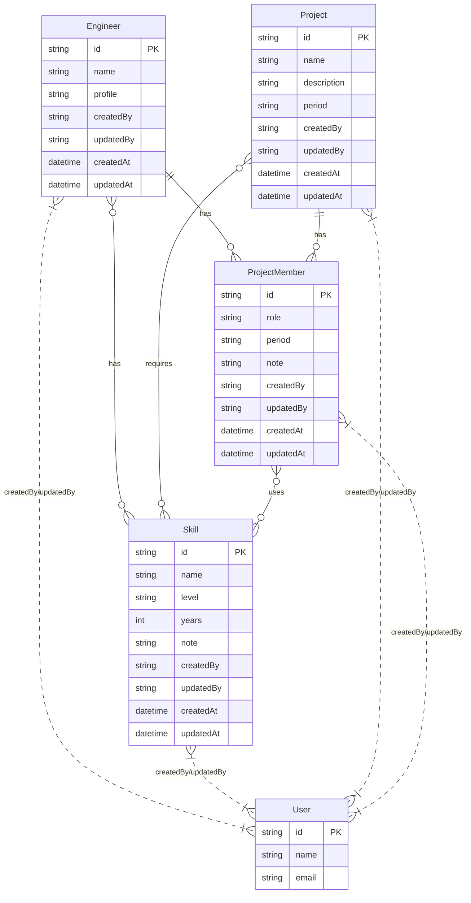

# データモデル設計（案件スキルの見える化ツール）

---

## 1. 主なエンティティと属性

### Engineer（エンジニア）
| 属性名         | 型              | 説明                       |
|:--------------|:----------------|:---------------------------|
| id            | string/number   | エンジニアID（主キー）     |
| name          | string          | 氏名                       |
| profile       | string          | プロフィール（自由記述）   |
| skills        | Skill[]         | 保有スキル（配列）         |
| projectHistory| ProjectMember[] | 参画案件履歴               |
| createdBy     | string          | 作成者ユーザーID           |
| updatedBy     | string          | 更新者ユーザーID           |
| createdAt     | Date            | 登録日時                   |
| updatedAt     | Date            | 更新日時                   |

---

### Skill（スキル）
| 属性名     | 型            | 説明                       |
|:----------|:--------------|:---------------------------|
| id        | string/number | スキルID（主キー）         |
| name      | string        | スキル名                   |
| level     | string/number | レベル                     |
| years     | number        | 経験年数                   |
| note      | string        | 備考                       |
| createdBy | string        | 作成者ユーザーID           |
| updatedBy | string        | 更新者ユーザーID           |
| createdAt | Date          | 登録日時                   |
| updatedAt | Date          | 更新日時                   |

---

### Project（案件）
| 属性名         | 型              | 説明                       |
|:--------------|:----------------|:---------------------------|
| id            | string/number   | 案件ID（主キー）           |
| name          | string          | 案件名                     |
| description   | string          | 案件内容                   |
| requiredSkills| Skill[]         | 必要スキル                 |
| members       | ProjectMember[] | 参画メンバー               |
| period        | string          | 期間                       |
| createdBy     | string          | 作成者ユーザーID           |
| updatedBy     | string          | 更新者ユーザーID           |
| createdAt     | Date            | 登録日時                   |
| updatedAt     | Date            | 更新日時                   |

---

### ProjectMember（案件参画メンバー）
| 属性名     | 型            | 説明                       |
|:----------|:--------------|:---------------------------|
| engineer  | Engineer      | エンジニア情報             |
| role      | string        | 案件内での役割             |
| skills    | Skill[]       | 案件で使ったスキル         |
| period    | string        | 参画期間                   |
| note      | string        | 備考                       |
| createdBy | string        | 作成者ユーザーID           |
| updatedBy | string        | 更新者ユーザーID           |
| createdAt | Date          | 登録日時                   |
| updatedAt | Date          | 更新日時                   |

---

### User（ユーザー）
| 属性名     | 型            | 説明                       |
|:----------|:--------------|:---------------------------|
| id        | string/number | ユーザーID（主キー）       |
| name      | string        | 氏名                       |
| email     | string        | メールアドレス             |

---

## 2. TypeScript型例

```ts
type WithAudit = {
  createdBy: string; // ユーザーID
  updatedBy: string; // ユーザーID
  createdAt: Date;
  updatedAt: Date;
};

type Skill = {
  id: string;
  name: string;
  level?: number | string;
  years?: number;
  note?: string;
} & WithAudit;

type Engineer = {
  id: string;
  name: string;
  profile?: string;
  skills: Skill[];
  projectHistory: ProjectMember[];
} & WithAudit;

type Project = {
  id: string;
  name: string;
  description?: string;
  requiredSkills: Skill[];
  members: ProjectMember[];
  period?: string;
} & WithAudit;

type ProjectMember = {
  engineer: Engineer;
  role?: string;
  skills?: Skill[];
  period?: string;
  note?: string;
} & WithAudit;

type User = {
  id: string;
  name: string;
  email: string;
};
```

---

## 3. ER図（Mermaid記法）



---

今後、運用や要件追加に応じて拡張・修正していきます。 